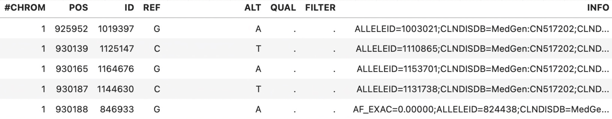
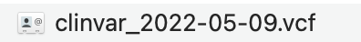
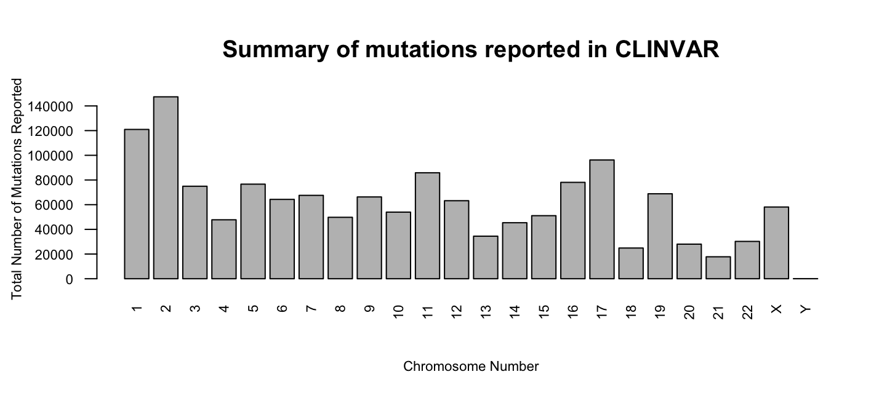

<!-- README.md is generated from README.Rmd. Please edit that file -->

```{r, include = FALSE}
knitr::opts_chunk$set(
  collapse = TRUE,
  comment = "#>",
  fig.path = "man/figures/README-",
  out.width = "100%"
)
```

# P3STAT294

<!-- badges: start -->
<!-- badges: end -->


## Overview 

`P3STAT294` extracts the latest version of vcf_GRCh37 published by  
ClinVar https://ftp.ncbi.nlm.nih.gov/pub/clinvar/ to create a database that the user can manipulate.


#### VCF files

The Variant Call Format (VCF) specifies the format of a text file used in bioinformatics for storing gene sequence variations.
The body of VCF is tab separated into 8 mandatory columns and an unlimited number of optional columns that may be used to record other information about the sample(s).

1	`CHROM`	The name of the sequence (typically a chromosome) on which the variation is being called.  
2	`POS`	The 1-based position of the variation on the given sequence.  
3	`ID`	The identifier of the variation.   
4	`REF`	The reference base (or bases in the case of an indel) at the given position on the given reference sequence.
5	`ALT`	The list of alternative alleles at this position.  
6	`QUAL`	A quality score associated with the inference of the given alleles.  
7	`FILTER`	A flag indicating which of a given set of filters the variation has failed or PASS if all the filters were passed successfully.  
8	`INFO` An extensible list of key-value pairs (fields) describing the variation. Multiple fields are separated by semicolons with optional values in the format: <key>=<data>[,data].  

The vcf_GRCh37 file published by CLINVAR contains the following information  
{width=700px}


## Installation

You can install the development version of `P3STAT294` from [GitHub](https://github.com/) with:


```{r example0, eval = FALSE}
# install.packages("devtools")
devtools::install_github("anagonzalezalvarez/P3STAT294", build_vignettes = TRUE)
```

## Example

This is a quick introduction of how to use the `P3STAT294` package. 

In `P3STAT294`, the main function we will use is named `download_clinvar()`, it has no arguments, and downloads in the working directory the latest version of Clinvar's vcf_GRCh37 into a file 
clinvar_date.vcf. This file is then turned into a database that the function uses
to plot a barplot of all the mutations reported in each chromosome 

This is a basic example which shows you how to download the ClinVar database:

```{r example2, eval = FALSE}
library(P3STAT294)

mutations_summary <- download_clinvar()
## Will obtain barplot 's vcf_GRCh37
```

The vcf_GRCh37 will be located in the working directory{width=200px}


The output of the function is a barplot with the counts of mutations in each chromosome obtained from the latest version of Clinvar


{width=700px}


